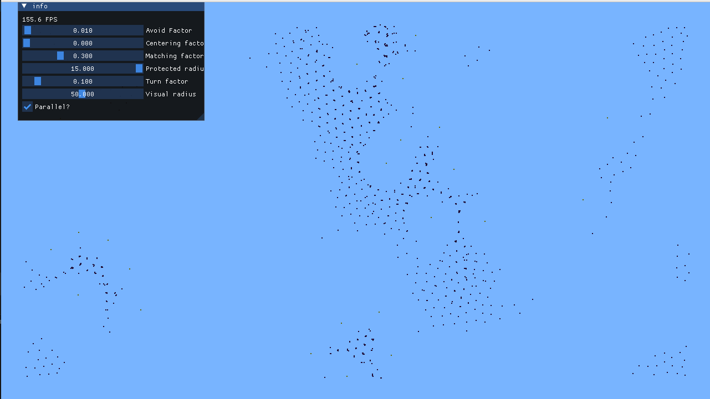

# Proyecto: Parallel Boids
Implementación de la simulación de boids, aprovechando el calculo en paralelo. Además, optimizado con el uso de 
QuadTree para radius querys y la creación de un método de insert en masa en paralelo con **OMP**. 
Se incluye una interfaz gráfica en el que se pueden modificar los variables del entorno *in-real-time*.

